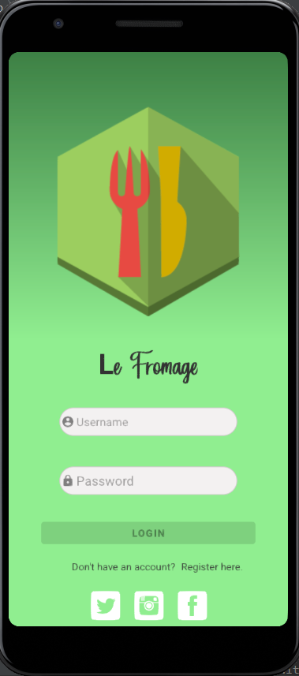
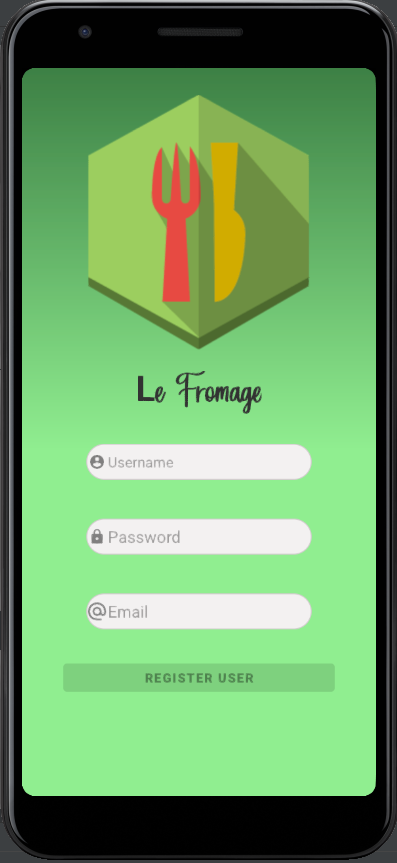
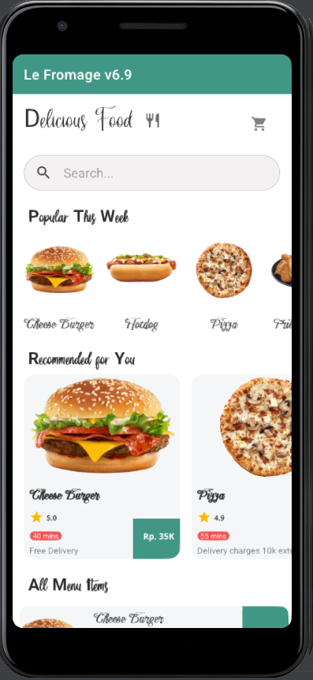
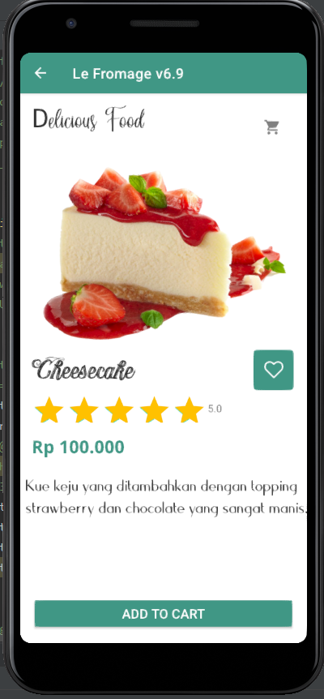
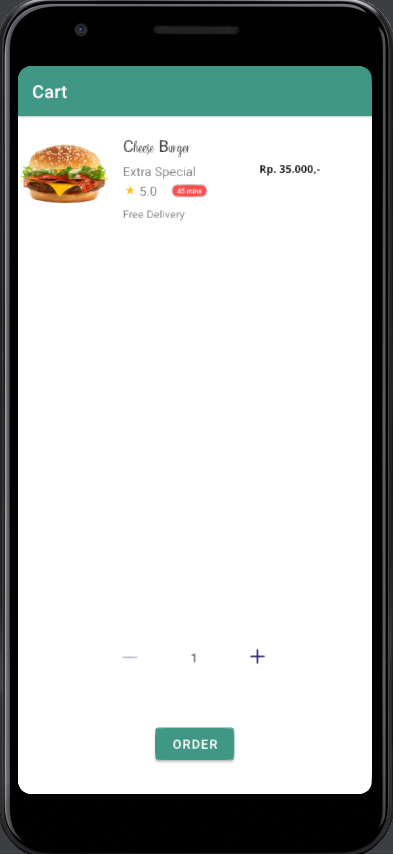
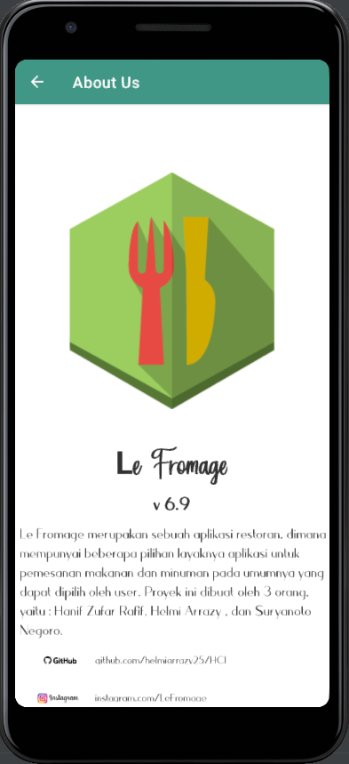

# HCI
**Proyek UTS Interaksi Manusia dan Komputer**

Universitas Indonesia, Fakultas Teknik, Teknik Komputer 2018

**Judul Proyek : "Le Fromage v6.9"**

**Anggota Kelompok :**

1. Hanif Zufar Rafif       (1806200412)
2. Helmi Arrazy (Ketua)    (1806200141)
3. Suryanoto Negoro        (1806200122)

**Kolaborator/tim (ruki.hwyu@gmail.com DAN ruki.h@ui.ac.id)**

**WHAT :** Le Fromage merupakan sebuah aplikasi restoran berbasis android, dimana mempunyai beberapa pilihan layaknya aplikasi untuk pemesanan makanan dan minuman pada umumnya yang dapat dipilih oleh user. Menu makanan dan Minuman dibuat dengan menggunakan API melaui AWS. Proyek ini dibuat oleh 3 orang, yaitu : Hanif Zufar Rafif, Helmi Arrazy , dan Suryanoto Negoro. 

**WHO, WHERE, WHEN :** Aplikasi ini ditujukan kepada siapa saja yang ingin memesan makanan atau minuman. Aplikasi ini bisa digunakan dimana saja selama terhubung ke internet karena menu makanan dan minuman yang ada di aplikasi semuanya menggunakan API sehingga membutuhkan akses internet. Aplikasi ini bekerja selama 24 jam jadi bisa digunakan kapan saja ketika user ingin memesan makanan atau minuman.

**WHY :** Aplikasi ini cukup penting karena dapat membantu user agar bisa bisa memesan menu makanan dan minuman yang ada walaupun jarak lokasinya cukup jauh. Sederhananya dapat menghemat waktu dan praktis karena user tidak perlu repot repot datang ke restoran.

**HOW :** Filosofi pada aplikasi  ini adalah user yang melakukan interaksi (input) atau pemesanan akan mendapatkan output yang sangat baik dengan service yang memuaskan, dan pemilihan interface yang mudah digunakan oleh user. Selain itu nama Le Fromage diambil dari bahasa Prancis yang artinya adalah Keju, karena pada aplikasi ini ada 2 menu yang mempunyai rating bintang 5 yang artinya banyak sekali orang yang menyukainya, yaitu Cheese Burger dan Cheesecake.

**Jumlah Activity :** 6
1. RegisterUser
2. LoginActivity
3. MainActivity
4. FoodDetails
5. CartActivity
6. AboutUs

**Screenshot Program Aplikasi :**
1. Login

2. Register

3. Main

4. Food Detail

5. Cart

6. About Us

**IDE yang dibutuhkan :**
1. Android Studio versi 4.1 keatas
2. JDK versi 8 keatas
3. Library 

**Cara menggunakan :**
1. Unduh android studio versi 4.1 minimum 
2. Install android studio beserta SDK dan JDK
3. Membuat Android Virtual Device dengan API 27 (Oreo) minimum
4. Buka Project pada android studio sesuai dengan lokasi pengunduhan source code
5. Build project, pada tahap ini project telah di clone
6. Run project pada AVD

**Alur Singkat Cara Kerja Program Aplikasi :** Pertama ketika user membuka aplikasi akan dibawa ke interface login, jika user belum mempunyai akun maka dapat membuatnya terlebih dahulu dengan klik tulisan "register here", setelah register user akan dibawa lagi ketampilan login untuk memasukkan informasi akunnya. Setelah login akan ke tampilan utamanya, disana ada 3 submenu yaitu popular, reccommended, dan all menu. User juga bisa mencari nama makanan atau minuman yang ingin dicari untuk menghemat waktu, hasil pencarian akan ditampilkan di bagian all menu. Untuk ketampilan About Us user dapat menekan gambar garpu dan pisau yang ada disebelah tulisan "Delicious Food". Tampilan informasi secara mendetail terkait makanan dan minuman akan ditampilkan jika user menekan gambar atau minuman yang dipilih, nanti akan ada pilihan add to cart, selanjutnya makanan akan ditampilkan dibagian cart (gambar keranjang).
